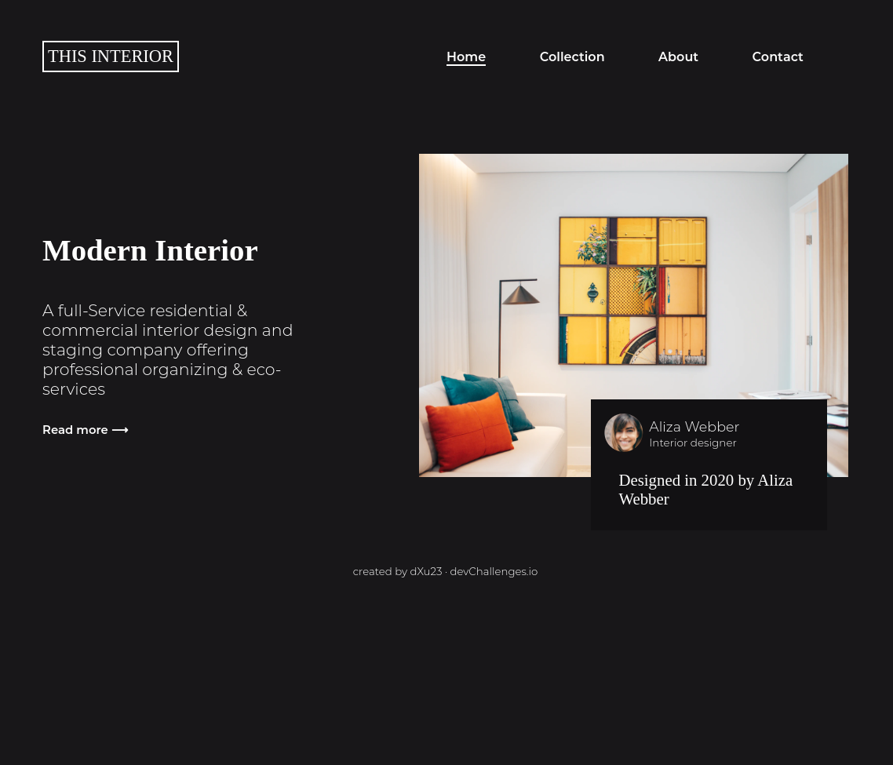

<!-- Please update value in the {}  -->

<h1 align="center">Interior Consultant</h1>

   Solution for a challenge from  <a href="http://devchallenges.io" target="_blank">Devchallenges.io</a>.

  <h3>
    <a href="https://coldfix.dev/dev-challenges/interior-consultant/interior.html">
      Demo
    </a>
     | 
    <a href="https://{your-url-to-the-solution}">
      Solution
    </a>
     | 
    <a href="https://devchallenges.io/challenges/Jymh2b2FyebRTUljkNcb">
      Challenge
    </a>
  </h3>

<!-- TABLE OF CONTENTS -->

## Table of Contents

- [Overview](#overview)
  - [Built With](#built-with)
- [Features](#features)
- [Contact](#contact)
- [Acknowledgements](#acknowledgements)

<!-- OVERVIEW -->

## Overview

Introduce your projects by taking a screenshot or a gif. Try to tell visitors a story about your project by answering:

- Where can I see your demo?

Right [here](https://coldfix.dev/dev-challenges/interior-consultant/interior.html)

- What was your experience?

This was a pretty hard challenge because I wasn't sure from the beginning how to
implement the mobile navigation menu. 

- What have you learned/improved?

I learned how to use absolute and relative positioning to overlay a div over an image,
as well as about CSS animations.

- Your wisdom? :)

### Built With

Just HTML, CSS, and JS. 

## Features

This application/site was created as a submission to a [DevChallenges](https://devchallenges.io/challenges) challenge. The [challenge](https://devchallenges.io/challenges/Jymh2b2FyebRTUljkNcb) was to build an application to complete the given user stories.

## Acknowledgements
- [Kevin Powell](https://www.youtube.com/watch?v=HbBMp6yUXO0)

## Contact

- Website [coldfix.dev](https://coldfix.dev)
- GitHub [@dXu23](https://github.com/dXu23)
